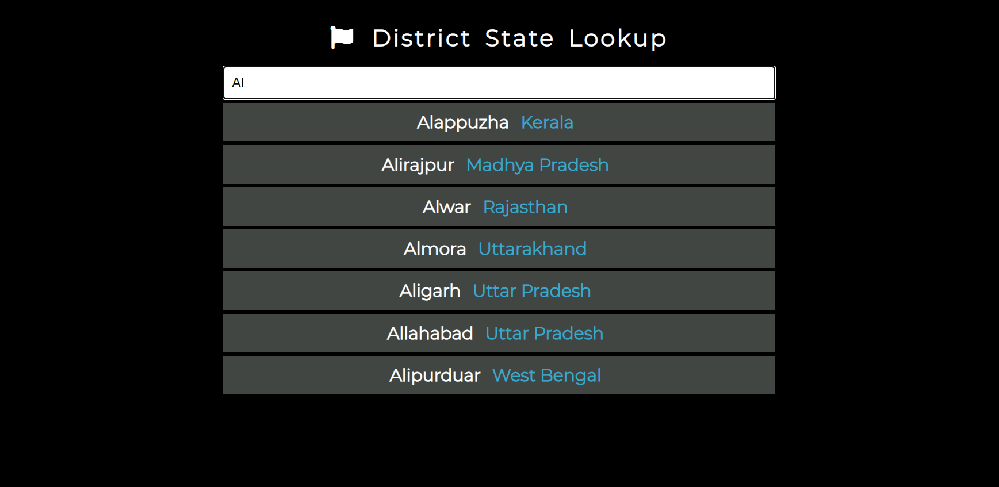

# District State Lookup

An application build using HTML, CSS and JavaScript. It can be used to find in which state or union territory of India the searched district belongs. It shows all the districts that match the current input. 